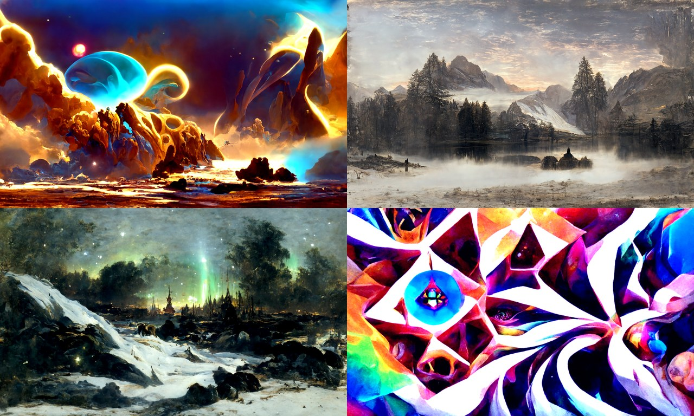

# Disco Diffusion (typed `uv` port)

A durable, strongly-typed port of the semi-famous 2022 [Disco Diffusion] CLIP-guided diffusion art generator. The original was a Google Colab notebook that bootstrapped itself with runtime `pip install` / `git clone` and pinned a long-dead ML stack.

This version is a proper Python library and CLI, managed with [`uv`](https://docs.astral.sh/uv/), typed under `mypy --strict`, and linted and formatted with `ruff`. It runs on a current PyTorch stack with CUDA 12.8 wheels, so it works on recent NVIDIA GPUs (developed on an RTX 5090, but Ampere cards like the 3090 are fine too). It's also self-contained: every fragile 2022 research repo it depended on is vendored in-tree under `src/disco_diffusion/vendor/`, so it keeps working even if those upstream repositories disappear. Only model weights are downloaded at runtime.

The 3D, video, turbo, VR and 2D-animation modes from the original are gone; this port only generates still images.



*Sample outputs at 1280×768, each CLIP-guided toward a different artist-style prompt.*

## Requirements

- `uv`
- An NVIDIA GPU with recent drivers (CUDA 12.8-capable). CPU works but is extremely slow. On NixOS, the provided `shell.nix` wires up CUDA/Triton.

## Setup

```sh
uv sync
```

This installs PyTorch from the CUDA 12.8 wheel index along with everything else. Check that the GPU is visible:

```sh
uv run python -c "import torch; print(torch.cuda.get_device_name(0), torch.cuda.is_available())"
```

## Usage

Generate the canonical lighthouse image with the faithful defaults (1280×768, 250 steps, ViT-B/32 + ViT-B/16 + RN50, secondary model). The first run downloads ~2.5 GB of model weights into `models/`:

```sh
uv run disco-diffusion generate
```

A quick, low-fidelity smoke test:

```sh
uv run disco-diffusion generate --steps 25 --width 512 --height 512 \
    --prompt "a beautiful painting of a lighthouse, trending on artstation"
```

Useful options (`disco-diffusion generate --help` for the full list):

| Option | Default | Meaning |
| --- | --- | --- |
| `--prompt, -p` | lighthouse | Text prompt (repeatable; supports `text:weight`) |
| `--steps` | 250 | Diffusion steps |
| `--width` / `--height` | 1280 / 768 | Output size (snapped down to a multiple of 64) |
| `--seed` | random | Reproducibility seed |
| `--n-batches` | 1 | Number of images to generate |
| `--clip-guidance-scale` | 5000 | Strength of CLIP guidance |
| `--init-image` | none | Init image path/URL (set `--skip-steps` to ~50% of steps) |
| `--diffusion-model` | `512x512_diffusion_uncond_finetune_008100` | Primary checkpoint |
| `--sampling-mode` | `ddim` | `ddim` or `plms` |
| `--clip-model` | (the three above) | CLIP model (repeatable) |
| `--cutn-batches` | 4 | CLIP guidance samples per step (lower = faster, slightly noisier) |
| `--guidance-every` | 1 | Recompute CLIP guidance every N steps (1 = faithful; 2 ≈ 1.46× faster) |
| `--compile` / `--no-compile` | on | `torch.compile` the UNet + CLIP (~1.5× faster once warm) |
| `--cpu` | off | Force CPU |

Images and a JSON settings dump are written to `images_out/<batch_name>/`.

### Library API

For a one-shot batch run, mirror the CLI with a `RunConfig`:

```python
from disco_diffusion import RunConfig, generate

paths = generate(RunConfig(prompts=["a serene mountain lake at dawn"], steps=100))
print(paths)
```

### External-control API (drive the loop yourself)

`DiscoSession` lets you take the sampling loop apart: load the models once, encode as many
prompts as you like, then step the loop manually and choose which encoded prompts — and at
what weights — to apply at *each* step. Encoding is paid once; mixing per step is cheap, so
you can crossfade, swap, or blend prompts live while the image is forming.

```python
from disco_diffusion import DiscoSession, RunConfig

session = DiscoSession(RunConfig(compile=False))
sky = session.encode("a clear blue sky")
storm = session.encode("a violent thunderstorm")

sampler = session.sampler(width=512, height=512, steps=100, seed=42)
for step in sampler:                       # one diffusion step per iteration
    w = step.index / step.total            # crossfade sky -> storm over the run
    sampler.set_conditioning([(sky, 1 - w), (storm, w)])
sampler.current_pil().save("out.png")
```

`set_conditioning` may be called between any two steps; the guidance reads the active mix
every step. The batch `Generator` is built on exactly these primitives, so both paths share
one copy of the model-loading and guidance code.

### Interactive app: Disco Diffusion Studio

[`studio/`](studio/README.md) is a [pygame-ce](https://pyga.me/) + `pygame_gui` desktop app
built on this external-control API. It shows the image as it forms and lets you add/remove
prompts, drag per-prompt weight sliders (with a live normalised-mix readout), play/pause/stop,
set the step count and size, and save — all live, between steps. Full-quality steps are slow
on purpose, so each one is a window to retune the mix and watch the image respond.

It's a [`uv` workspace](https://docs.astral.sh/uv/concepts/projects/workspaces/) member, so
it runs straight from the repo root (it shares the library's environment and model weights):

```sh
uv run disco-studio
```

## Performance

The default 1280×768 / 250-step run takes about 59 seconds once warm on an RTX 5090, down from ~124 seconds right after the port. That's roughly 2.1× faster with no visible change to the output, since it stays within the run-to-run noise floor. The speedups come from `torch.compile` (with `max-autotune`), batched CLIP guidance, TF32, and a cached resize matrix for the cutouts.

`torch.compile` is on by default. The first run with a given configuration pays a one-time compile and autotune cost, which is cached on disk under `models/.inductor_cache`, so later runs are fast; pass `--no-compile` to skip it. The optional `--fast`, `--cutn-batches`, and `--guidance-every` levers trade a measured amount of fidelity for more speed, and are all off by default.

See [PERFORMANCE.md](PERFORMANCE.md) for the per-optimization breakdown, the measured impact at each milestone, why ~59 s is the faithful floor (and what got tried and dropped), and the opt-in levers.

## Development

```sh
uv run ruff check . && uv run ruff format --check .
uv run mypy src
```

## Credits & license

Disco Diffusion is the work of many people; see [`CREDITS.md`](CREDITS.md) for the full provenance and the licensing of each vendored component. The project is MIT-licensed (© 2021 Katherine Crowson); see [`LICENSE`](LICENSE). This port keeps that license and all the original attribution.

[Disco Diffusion]: https://github.com/alembics/disco-diffusion
