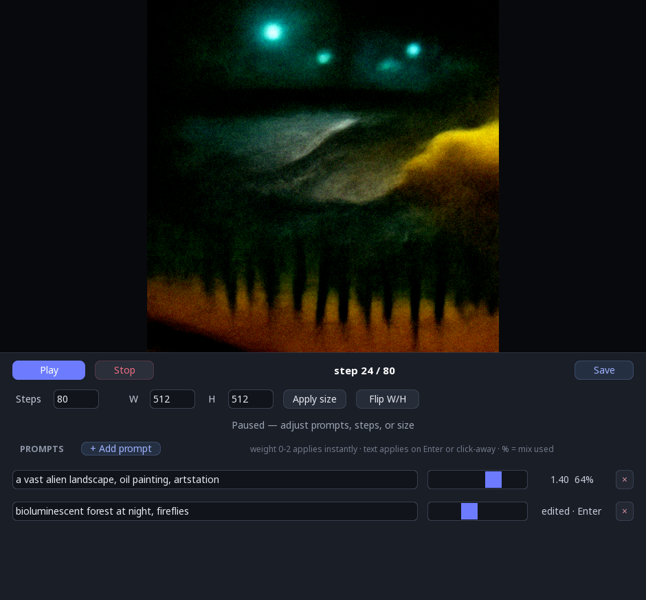
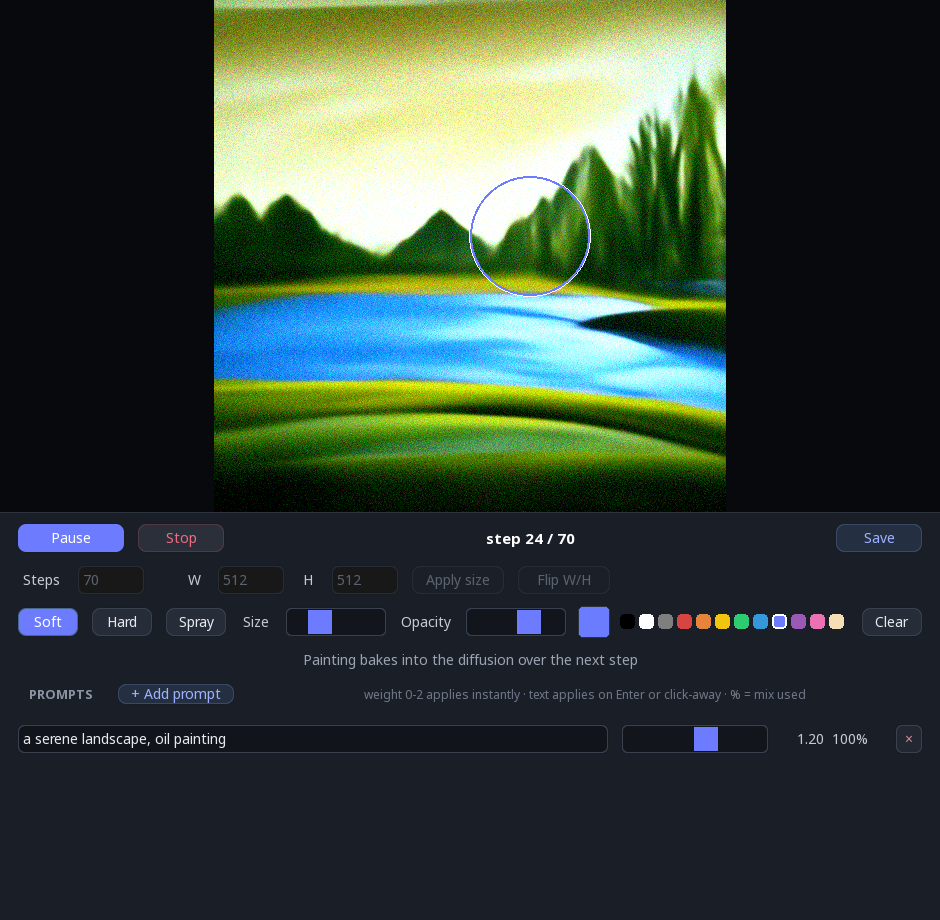

# Disco Diffusion Studio

An interactive desktop UI for [Disco Diffusion](../README.md), built on its external-control
API (`disco_diffusion.DiscoSession`). It takes manual control of the sampling loop so you can
**steer the image as it forms** — mixing, crossfading, and swapping prompts live, between steps.

Full-quality steps are slow on purpose: each one is a window to retune the prompt mix and watch
the image respond.



## What you can do

- **Play / Pause / Stop** the diffusion loop (Space toggles play/pause); a step counter shows
  progress.
- **Prompts / Advanced tabs**: the panel's lower area switches between the prompt list and an
  **Advanced** panel of guidance controls (same footprint — no taller window).
- **Prompts**: add/remove rows, each with a live **weight slider (0–2)**. Text applies on
  Enter *or* when you click away; an amber `edited · Enter` badge shows when a box hasn't been
  applied yet. Each row shows the **normalised %** it actually contributes to guidance.
- **Advanced — live guidance**: sliders for `clip_guidance_scale`, `tv_scale` (smoothing),
  `range_scale`, `sat_scale`, `clamp_max`, and `cutn_batches`. These are read **every step**,
  so dragging one retunes the run on the next step (no restart) — and seeds the next run when
  stopped. Higher CLIP guidance = stronger prompt adherence; TV/range/sat are the regularisers
  that keep detail from turning to mush.
- **Advanced — cut schedules + presets**: raw schedule strings for `cut_overview` /
  `cut_innercut` / `cut_ic_pow` / `cut_icgray_p` (e.g. `[12]*400+[4]*600`), plus one-click
  **full-recipe presets** (`Default`, `2022 sauce`). A preset sets *everything* — the guidance
  sliders, eta/Perlin, and all four schedules at once — and stages its CLIP model set +
  secondary toggle (press **Reload** to actually load those). The schedules are snapshotted
  when a run starts, so they **apply on the next Play**. Edits are validated (and must cover
  the 1000-step timeline) before they take —
  a malformed or too-short schedule is rejected and the previous value kept. `cut_ic_pow` is
  the detail knob (higher = more fine texture); overview vs inner cuts trade global
  composition for local detail across the run.
- **Advanced — eta / Perlin init**: `eta` (DDIM stochasticity, 0 = deterministic) and a
  **Perlin init** toggle that seeds a fresh run from Perlin noise instead of flat gaussian.
  Both are per-run — they take effect on the next Play.
- **Advanced — models**: toggle the **CLIP model set** (add ViT-L/14, RN50x4, …) and the
  **secondary model**, then press **Reload**. Reloading rebuilds the session (loads weights,
  ~a minute; longer if a model still needs downloading) on a **background thread**, so the UI
  stays responsive — Play and Reload lock until it's ready. More/larger CLIP models = stronger,
  higher-quality guidance at a real speed cost.
- **Steps**: set the total step count (while paused/stopped).
- **Size**: width/height (snapped to multiples of 64) and a landscape/portrait flip. The
  canvas (at the chosen size) is shown before you generate, so you can see the aspect — and
  paint on it — before pressing Play.
- **Canvas navigation**: the window is a viewport onto the canvas. **Hold the right mouse
  button** to navigate — drag to pan, scroll to zoom toward the cursor; release to go back to
  drawing. **F** fits the canvas to the window, **0** is 100%. A help line in the canvas
  corner shows the bindings for the current mode.
- **Paint** directly onto the canvas to steer the diffusion (drawing mode). Left-drag with a
  brush (Soft / Hard / Spray); **scroll** changes brush size and **Shift+scroll** changes
  opacity; a colour palette and a brush-preview ring follow the cursor. Strokes are noised to
  the current step and injected into the live latent, so the painted region pulls the image
  toward your colours/shapes and then evolves with the prompts. Strokes show as an overlay
  until a step bakes them in; **Clear** discards unbaked strokes.
  - Toggle **Noise** to deposit *fresh tinted noise* instead of plain colour: the region is
    replaced with new noise at the current level, biased to your colour, so the model invents
    **new structure** there. This is what you want early on — a plain colour stroke is washed
    out by the renoise at high noise levels, whereas tinted noise survives and gets resolved
    into shapes of that colour. Opacity is mapped through a gentle curve into a capped range,
    so the low end is subtle and even a full stroke re-rolls a controlled fraction (the overlay
    stays full so you can see what you painted). Paint with steps remaining so it can resolve.
- **Edit history / revert**: each edit (paint, prompt change) drops a checkpoint. While paused
  *or after the run finishes*, drag the **History** slider to preview an earlier checkpoint —
  its image *and* prompts (the prompt list is read-only while scrubbing). **Revert** branches
  the run from there (resumes from that latent, restores those prompts, and continues forward)
  or **Cancel** returns to the live state. After finishing, **Play** starts a fresh run.
- **Save** the current frame — opens a file dialog (the frame is frozen when you click, so it
  won't change while you pick a location); a `.png` extension is added if you omit one.

Generation runs on a background thread, so the UI stays responsive while the GPU works.



## Running

This is a [uv workspace](https://docs.astral.sh/uv/concepts/projects/workspaces/) member of the
Disco Diffusion repo, so run it **from the repo root** — it shares the library's environment and
model weights (and pulls PyTorch from the CUDA 12.8 wheel index, same as the library):

```sh
# from the repo root:
uv run disco-studio
```

Options: `disco-studio --help` (`--steps`, `--width`, `--height`, `--compile`, `--cpu`,
`--models-dir`, `--out`). Paths default to the repo-root `models/` and `images_out/`.

`torch.compile` is **off by default**. It's worth enabling (`--compile`) on a GPU with free
VRAM headroom or for smaller/lighter runs (~1.4× faster steps, with a one-time ~60s warmup per
size, cached on disk). It's **robust** — compile-time errors and OOM fall back to eager rather
than crashing — but it's off by default because the heavy multi-CLIP presets at large sizes
need ~21 GB *to compile* (a transient warmup spike; steady state fits in ~15 GB), which can
exceed the free memory on a shared desktop GPU. Eager already runs the `2022 sauce` preset at
1280×768 in ~1.5 min on a 5090 (thanks to the single-forward guidance path), so compile isn't
needed there.

## Layout

```
src/disco_diffusion_studio/
  app.py      # the App: window, widgets, event loop, run lifecycle
  worker.py   # GenerationWorker: the background thread driving a Sampler
  paint.py    # brushes, colour palette, and the paintable RGBA layer
  layout.py   # sizing tokens + a tiny flow layout (Row / Stack)
  theme.py    # palette + pygame_gui theme
```

## Development

From the repo root (the workspace runs ruff/format/mypy over this member):

```sh
uv run --directory studio ruff check .
uv run --directory studio ruff format --check .
uv run --directory studio mypy
```
